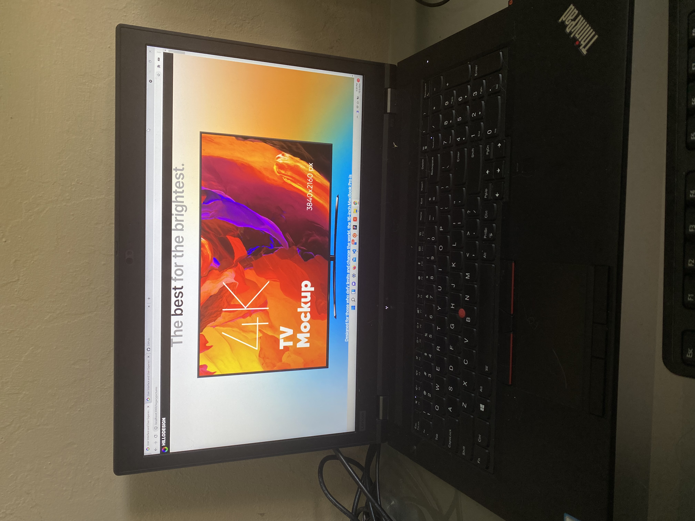

# Hillodesign

## UI/UX Designer Portfolio Website built with React.JS, Bootstrap 4, hosted with Github Pages.

### When installing on fresh system

This application will run on a similar system as the development environment, which is a Windows 11 Pro OS with Windows Subsystem Linux (WSL2). Other similar Unix systems such as Ubuntu or MacOS can run these commands. For Windows systems using CMD or powershell will need to install using similar commands.

# Deploying to Github Pages

Don't run this command unless react is already installed.

    npm run deploy

## Features

6 portfolio pieces in each individual page.  

Home page.

Contact Page.

React App using React Router to route to different pages.

Single Page Web App, load all assets of websites in inital load, so the website will run fast no matter what device and internet network.

Loading Screen that will show how long the user will have to wait for the portfolio to load..

Check if the user is using a mobile device, maybe load a mobile version of the site using assets of different sizes so it will load faster.

## Installing React App

To Install React just use the CLI

    npx create-react-app nameofapp

This command will install React App

Make sure to have node and npm installed.

## Convert App from JavaScript to TypeScript

1. Add TypeScript to Project

    npm install --save typescript @types/node @types/react @types/react-dom @types/jest

2. Add the tsconfig.json

    npx tsc --init

3. Change file extension of files to .jsx

## Installing React Router to React.JS App

React Router is the functionality to route HTML via the Single Page Web Application Functionality.

Using this functionality we can implement menus and sub menus and direct the single page to various HTMLs to simulate a multi page experience.

Install via npm

    npm install react-router-dom

Example code of React Router

    import React from "react";
    import {
    BrowserRouter as Router,
    Switch,
    Route,
    Link
    } from "react-router-dom";

    export default function App() {
    return (
        <Router>
        

            <nav>
            <ul>
                <li>
                <Link to="/">Home</Link>
                </li>
                <li>
                <Link to="/about">About</Link>
                </li>
                <li>
                <Link to="/users">Users</Link>
                </li>
            </ul>
            </nav>

            {/* A <Switch> looks through its children <Route>s and
                renders the first one that matches the current URL. */}
            <Switch>
            <Route path="/about">
                <About />
            </Route>
            <Route path="/users">
                <Users />
            </Route>
            <Route path="/">
                <Home />
            </Route>
            </Switch>
        

        </Router>
    );
    }

    function Home() {
    return <h2>Home</h2>;
    }

    function About() {
    return <h2>About</h2>;
    }

    function Users() {
    return <h2>Users</h2>;
    }

## Installing React-Bootstrap

Install via npm

    npm install react-bootstrap bootstrap

## Components

We are using components in the src folder.

Just create a new dir for each component.

Reference the component from the App.js file in the src this way

    import { Test0 } from './components/home'

Then in the 

    index.js 

Create the compnent and export the component

    import React from 'react';
    import Card from 'react-bootstrap/Card';

    export const Test0 = () => (
    <Card>
    <Card.Body>This tttis some text within a card body.</Card.Body>
    </Card>
    )

## Pages of Website

- Home

- Contact/About

- Portfolio Page 1 

- Portfolio Page 2

- Portfolio Page 3

- Portfolio Page 4

- Portfolio Page 5

- Portfolio Page 6

## Embed Codepen to react with tool

    npm install --save react-codepen-embed

Usage

    import React from "react";
    import Codepen from "react-codepen-embed";

    const CodepenEmbedded = () => {
    return <Codepen hash="JyxeVP" user="shettypuneeth" />;
    };

    s<Codepen
    hash="JyxeVP"
    user="shettypuneeth"
    loader={() => 
Loading...
}
    />

## Component 

Put all parts inside the container jsx tag

    export const Pg1 = () => (
        /* Start of JSX Fragment*/ 
        <>

        <Container fluid>
        </Container>

        </>
        /* End of JSX Fragment*/
    )

## Case Study Part

    <Jumbotron fluid>
        <Container>
        <h5>Case Study</h5>
        <h1>Uguru, INC</h1>
        

        Mobile Application for College Students
        

        <h5>Project Date:</h5>
        

        October 2016 - January 2017
        

        <h5>Role:</h5>
        

        Graphic UI/UX Intern to creating High-Fidelity User Interfaces and Rapid prototypes
        

        </Container>
    </Jumbotron>

## Video  

    {/* Video */}
        <Row>
    <Col sm>
    <video autoPlay preload="true" loop playsInline muted>
      <source src={Vid1} type="video/mp4" />
    </video>
      </Col>
      </Row>

## img with text

        {/* img with text */}
        <Row>
    <Col sm>
      <h3>test</h3>
      
test

    <Image src={Pg1Img} fluid className="pg1Img" />
    </Col>
    </Row>
    
## left text right img

                {/* left text right img */}
            <Row>
        <Col sm>
        <h3>test</h3>
        
test

        </Col>
        <Col sm>
        <Image src={Pg1Img} fluid className="pg1Img" />
        </Col>
        </Row>

## left img right text

        {/* left img right text */}
        <Row>
    <Col sm>
    <Image src={Pg1Img} fluid className="pg1Img" />
    </Col>
    <Col sm>
      <h1>test</h1>
      <h3>test</h3>
    </Col>
    </Row>

## img without text

    {/* img without text */}
        <Row>
        <Col sm>
        <Image src={Pg1Img} fluid className="pg1Img" />
        </Col>
        </Row>

## codepen

    {/* codepen*/}
    <Row>
            <Col sm>
            <Codepen
            hash="WNrqqqe"
            user="jaemnkm"
            defaultTab="result"
            preview="false"
        />
            </Col>
        </Row>

## Installing scroll to top

    npm install react-router-scroll-top --save

Then import it 

    import ScrollToTop from 'react-router-scroll-top'

Then add it to as a jsx tag within the router

    <ScrollToTop></ScrollToTop>

This is when the user selects something in the top nav it to scroll the user back to the top of the page.

## Installing scroll to top when user scroll down page

    npm install react-scroll-up-button

    import React from "react";
    import ScrollUpButton from "react-scroll-up-button"; //Add this line Here
    
    export default class Index extends React.Component {
        render() {
            return (
                

                    <ScrollUpButton />
                    //This is all you need to get the default view working
                

            );
        }
    }
    

## Using Link to redirect route onclick of element

    import { Link } from 'react-router-dom'

        <Jumbotron fluid>
    <Container>
        <h1>DasDasDigital</h1>

    <Link to={'/pg2'}>
    <button > Click Me </button>
    </Link>
    </Container>
    </Jumbotron>

## Using Localized Scope Module CSS Files

To modulate the CSS of each component need to use Modules.

So for example first create the correct file

    test.module.css

Now import it into the js file of the component test

In test.js

    import styles from 'test.module.css';

Now in the component test

    export const test =() => (

        

    )

This will allow each component to have modulated CSS.

## Install webfrontloader

    npm install webfontloader --save

Installing

    import WebFont from 'webfontloader';

    WebFont.load({
    google: {
        families: ['Titillium Web:300,400,700', 'sans-serif']
    }
    });

## Precache 

    npm install --save react-precache-img

    import React from 'react';
    import PreCacheImg from 'react-precache-img';

    return (
        <PreCacheImg
        images={[
            'http://searchengineland.com/figz/wp-content/seloads/2015/12/google-amp-fast-speed-travel-ss-1920.jpg',
            'https://upload.wikimedia.org/wikipedia/commons/6/62/Starsinthesky.jpg'
        ]}
        />
    );

## Parallax effect

    npm i react-scroll-parallax --save

Usage
The <ParallaxProvider> should wrap the component tree that contains all <Parallax> components. This should be a top level component like <AppContainer>. For example:

    import { ParallaxProvider } from 'react-scroll-parallax';

    class AppContainer extends Component {
        render() {
            return (
                <ParallaxProvider>
                    <App />
                </ParallaxProvider>
            );
        }
    }

Import the Parallax component and use it anywhere within the provider like so:

    import { Parallax } from 'react-scroll-parallax';

    const ParallaxImage = () => (
        <Parallax className="custom-class" y={[-20, 20]} tagOuter="figure">
            <Image src="/image.jpg" />
        </Parallax>
    );

## Installing rehooks/window-scroll-position

    npm i @rehooks/window-scroll-position

## Installing React Awsome Reveal

    npm install react-awesome-reveal --save

## Installing React-router

    npm install @steveeeie/react-page-transition

    npm install react-router react-router-dom react-transition-group styled-components

## Typing animation

    npm i --save react-typing-animation

    import Typing from 'react-typing-animation';

    const AnimatedTypingComponent = () => (
    <Typing>
        This span will get typed.
    </Typing>
    );

## React Scroll-To

    npm i react-scroll-to --save

    // Scroll by a component's ref
    import React, { Component } from "react";
    import { ScrollTo } from "react-scroll-to";

    export default class MyComponent extends Component {
    myRef = React.createRef();

    render() {
        return (
        <>
            <ScrollTo>
            {({ scroll }) => (
                <a onClick={() => scroll({ ref: this.myRef, x: 20, y: 500 })}>
                Scroll to Bottom
                </a>
            )}
            </ScrollTo>

            
My Element

        </>
        );
    }
    }

Cant figure out how to implement there seens to be an issue related to 

    myRef = React.createRef(); 

## Install lazy load and image placeholder

    npm i --save react-lazy-load-image-component

## Install react-pdf

    npm install react-pdf

## Envato Elements Video Main 

https://elements.envato.com/modern-intro-AGHK6DJ

https://elements.envato.com/corporate-intro-VZ9X2DW

https://elements.envato.com/stylish-intro-3GMAC86

https://elements.envato.com/energy-intro-YWE6BVA

https://elements.envato.com/modern-intro-5J95E3J

https://elements.envato.com/grunge-intro-VL49NF8

https://elements.envato.com/epic-intro-VQZUDK3

https://elements.envato.com/parallax-intro-VGQ4SLH

https://elements.envato.com/parallax-intro-V8BD5S9

https://elements.envato.com/relaxing-intro-LNZCQSN

https://elements.envato.com/trailer-intro-VSMPRHZ

https://elements.envato.com/typo-intro-KPEZ2TX

https://elements.envato.com/movie-intro-UKVL9WG

https://elements.envato.com/modern-intro-VPCSV7Y

https://elements.envato.com/intro-opener-47DDKUV

https://elements.envato.com/dynamic-intro-VBRP5XA

https://elements.envato.com/elegant-intro-V6D2Y9H

## install react-animations

    npm i react-animations

## install react-awesome-reveal

    npm install --save react-awesome-reveal
